# CIROH AI Bot v2

CIROH AI Bot v2 is a multi-source Retrieval-Augmented Generation (RAG) system designed to provide conversational access to CIROH knowledge distributed across documentation, scientific publications, datasets, and software repositories.

The current repository contains the backend work completed to date. It includes the pipelines used to collect and structure the source data, create the database content, generate summaries and embeddings, and implement two complementary hierarchical retrieval strategies: **Top-down RAG** and **Bottom-up RAG**.

A third **Hybrid RAG** strategy is planned and is currently the next retrieval component under development.

---

## 1. Current Repository Scope

The current `v2-dev` branch primarily contains the backend implementation.

```text
backend/
├── database/
│   ├── CIROH-Hub/
│   ├── json/
│   ├── GitHub_CodeRepos.ipynb
│   ├── HydroShare_Datasets.ipynb
│   ├── PopulateDB.ipynb
│   └── ...
│
└── rag/
    ├── RAG_Pipeline.ipynb
    ├── rag_results_topdown.json
    ├── rag_results_bottomup.json
    └── ...
```

At this stage:

- the multi-source database pipeline is implemented;
- artifact and chunk representations are created for the supported sources;
- summaries, metadata, and embeddings are generated;
- Top-down retrieval is implemented;
- Bottom-up retrieval is implemented;
- initial retrieval outputs for both strategies are available;
- Hybrid retrieval is defined conceptually but not yet implemented;
- an API layer has not yet been created;
- the frontend is not currently included in this branch;
- automatic source synchronization is not yet integrated into the current ingestion workflow.

---

## 2. Knowledge Sources

The current backend integrates four main CIROH information sources:

1. **CIROH Hub**
2. **Scientific Publications**
3. **HydroShare Datasets**
4. **GitHub Code Repositories**

Although these sources have different structures and metadata, they are normalized into a common representation based on **artifacts** and **chunks**.

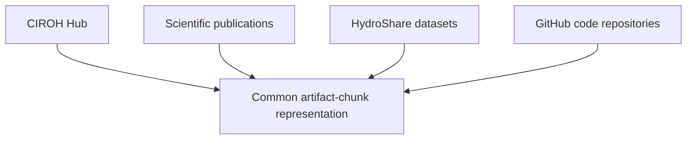

---

## 3. Artifact–Chunk Data Model

The central unit of organization is the **artifact**.

An artifact represents a complete knowledge resource, such as:

- a CIROH Hub webpage;
- a scientific publication;
- a HydroShare resource;
- a GitHub repository.

Each artifact can contain one or more **chunks**, which provide more granular units of information for retrieval.

Artifacts provide document-level context, while chunks provide more specific evidence.

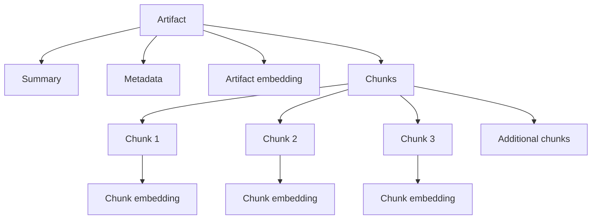

This hierarchical representation supports retrieval in both directions.

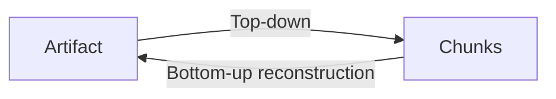

---

## 4. Source Ingestion Pipelines

### 4.1 CIROH Hub

CIROH Hub content is downloaded and converted into artifact and chunk representations.

The current ingestion supports content coming from several physical locations in the CIROH Hub source repository, including:

```text
docs/
blog/
release-notes/
src/pages/
_generated_js_pages/
```

Some CIROH Hub pages are originally implemented as JavaScript pages rather than standard MDX documentation pages. These pages are converted to MDX and stored under:

```text
CIROH-Hub/_generated_js_pages/
```

The ingestion logic resolves the public CIROH Hub URL independently from the physical location of the source file.

For example:

```text
Public page:
https://hub.ciroh.org/contribute/

Physical source:
CIROH-Hub/_generated_js_pages/contribute.mdx
```

Similarly, pages physically located under `src/pages/` are mapped to their public CIROH Hub paths rather than exposing the repository directory structure in the artifact URL.

The resulting normalized files are used to generate:

```text
backend/database/json/hub_artifacts.json
backend/database/json/hub_chunks.json
```

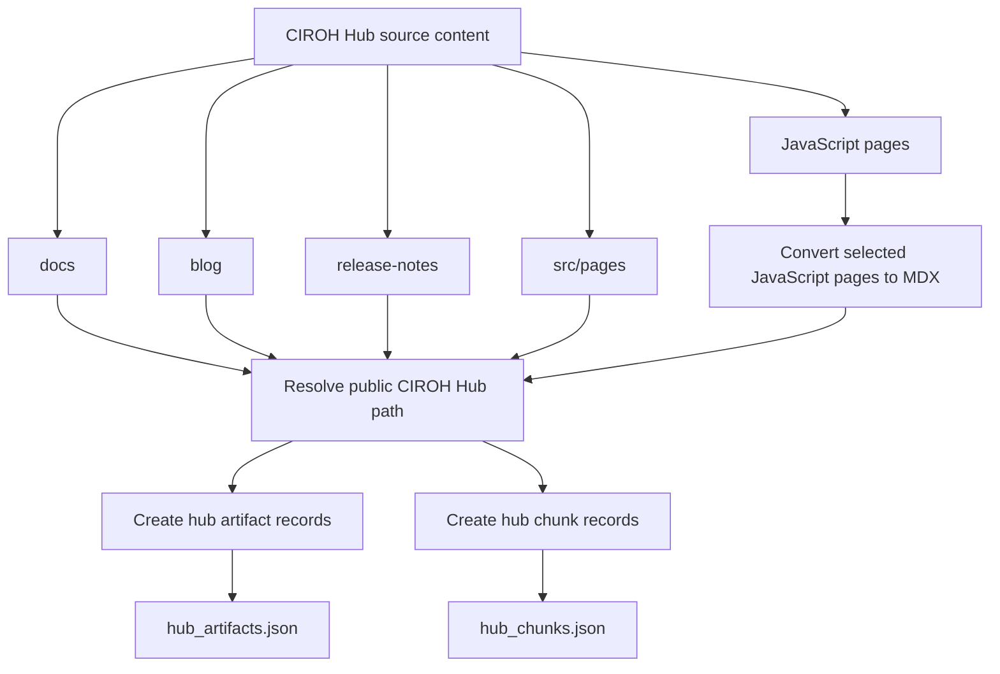

---

## 5. GitHub Repository Pipeline

`GitHub_CodeRepos.ipynb` processes CIROH software repositories.

Each repository becomes an artifact representing the software resource as a whole.

Repository content is then divided into chunks that provide more granular information for retrieval.

The pipeline extracts and organizes information useful for retrieval, including repository-level metadata and content from relevant repository files.

The resulting representations are stored in:

```text
backend/database/json/coderepo_artifacts.json
backend/database/json/coderepo_chunks.json
```

The artifact representation allows a query to identify the relevant repository first, while the associated chunks provide more specific evidence about implementation, usage, configuration, or documentation.

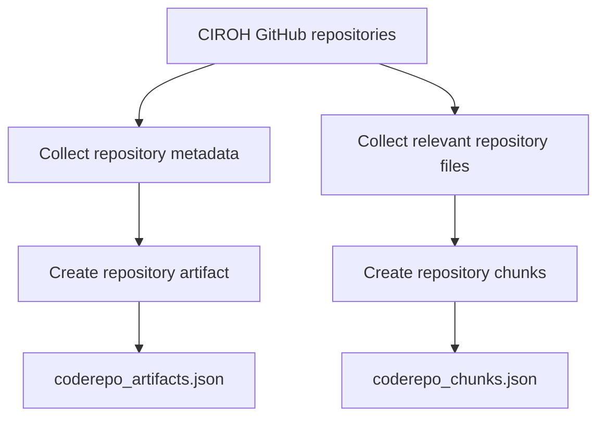

---

## 6. HydroShare Dataset Pipeline

`HydroShare_Datasets.ipynb` processes HydroShare resources associated with CIROH.

Each HydroShare resource is represented as an artifact.

The pipeline collects available resource metadata and extracts relevant textual information from the resource contents. This information is then converted into chunks while maintaining the relationship between each chunk and its parent HydroShare resource.

The resulting files provide both resource-level information for artifact retrieval and detailed resource content for chunk-level retrieval.

The normalized outputs are stored as HydroShare artifact and chunk JSON files under:

```text
backend/database/json/
```

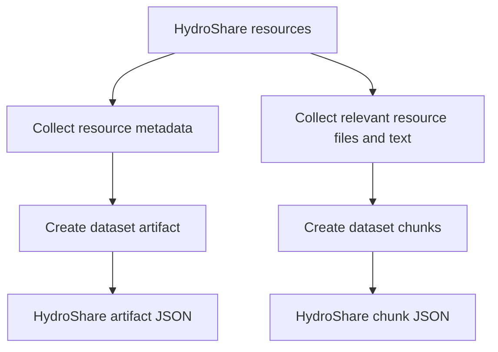

---

## 7. Scientific Publications

Scientific publications are also represented using the same artifact–chunk model.

A publication artifact contains document-level information and metadata, while its chunks represent more specific content extracted from the publication.

This allows publications to participate in the same retrieval architecture as documentation, datasets, and software repositories despite differences in their original structure.

The corresponding artifact and chunk JSON files are stored under:

```text
backend/database/json/
```

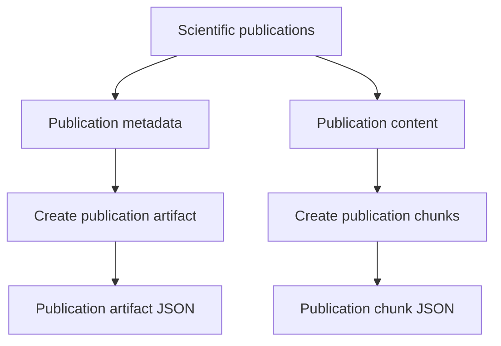

---

## 8. Intermediate JSON Representation

Before information is inserted into PostgreSQL, each source is normalized into two JSON structures:

```text
*_artifacts.json
*_chunks.json
```

The artifact files represent complete resources.

The chunk files represent the retrieval units associated with those resources.

This intermediate representation separates source-specific extraction from database population.

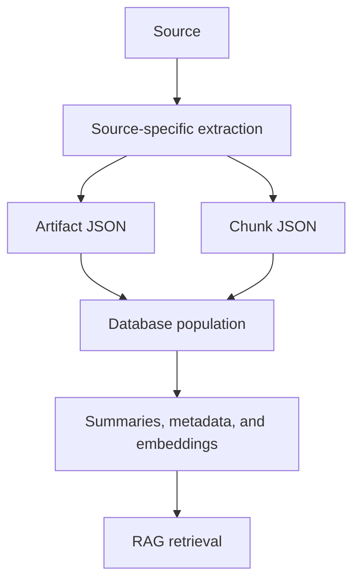

This design makes it possible to change or improve an individual source ingestion pipeline without changing the overall database or retrieval architecture.

---

## 9. Database Population

`PopulateDB.ipynb` integrates the normalized outputs from all four source types into the common database.

The database stores both artifact-level and chunk-level information.

At the artifact level, the system stores information such as:

- artifact type;
- title;
- URL;
- source-specific metadata;
- summary information;
- retrieval metadata;
- embedding;
- active/inactive status.

At the chunk level, the system stores:

- parent artifact;
- chunk type;
- chunk order;
- title;
- text;
- metadata;
- embedding;
- optional hierarchical parent information.

This structure makes it possible to retrieve information at different levels of granularity without maintaining separate retrieval systems for each source.

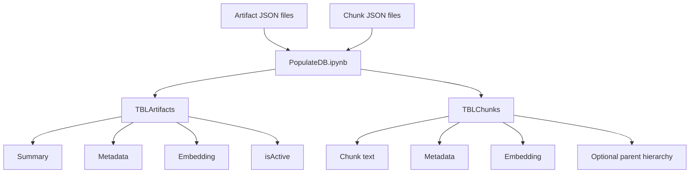

---

## 10. Artifact Summaries

Artifact-level summaries are generated to produce a compact semantic representation of each resource.

The summaries are intended to capture:

- what the artifact represents;
- its primary purpose;
- major topics;
- relevant entities;
- technical concepts;
- other information useful for semantic retrieval.

These summaries are particularly important for the Top-down strategy because artifact retrieval should represent the content and purpose of the complete resource rather than depend on individual passages.

Artifact embeddings therefore use information derived from the artifact summary and relevant metadata.

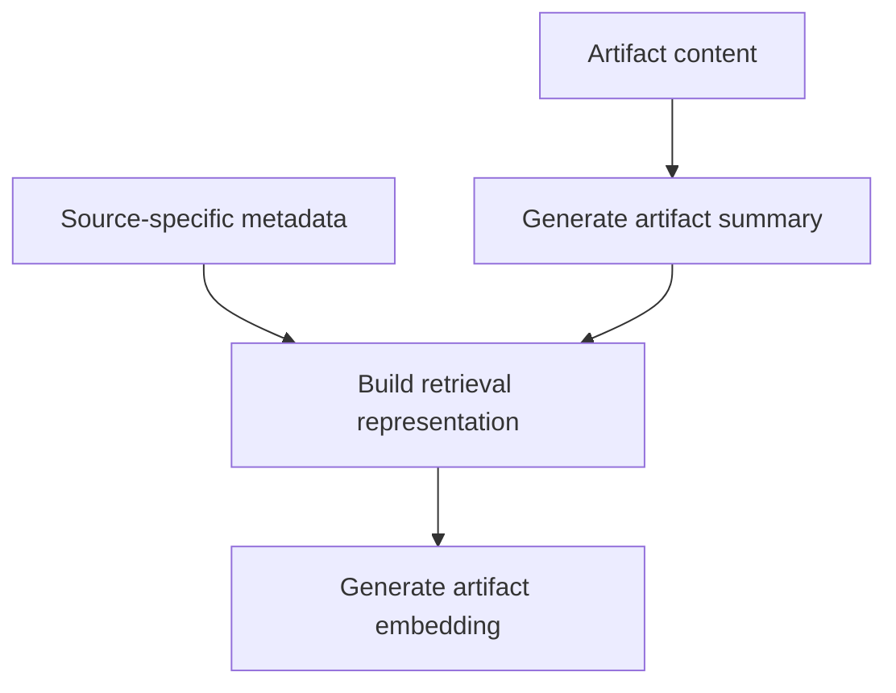

---

## 11. Metadata

Metadata is retained at both artifact and chunk levels where appropriate.

Because the four source types are structurally different, the available metadata varies by source.

Examples include information describing:

- publication characteristics;
- CIROH Hub pages;
- HydroShare resources;
- software repositories.

The retrieval pipeline uses a normalized representation while preserving source-specific metadata that may help distinguish or contextualize artifacts.

---

## 12. Embeddings

Embeddings are generated at two levels:

- **Artifact embeddings**
- **Chunk embeddings**

Artifact embeddings represent the broader semantic identity of a resource.

Chunk embeddings represent more specific evidence contained within that resource.

This dual representation is fundamental to the hierarchical retrieval design.

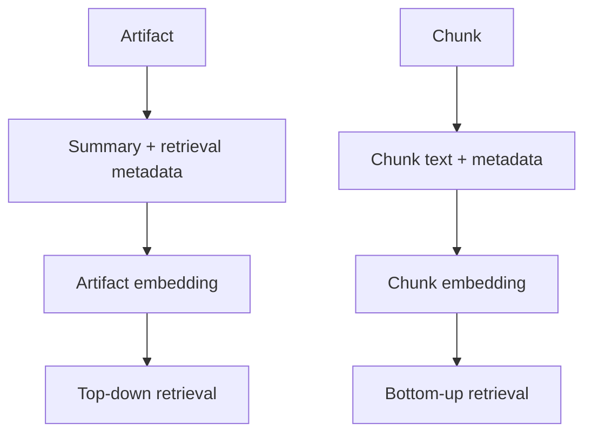

---

## 13. Versioning and the `isActive` Field

Artifacts include an `isActive` field to support an update-aware knowledge base.

The design intentionally avoids modifying an existing artifact in place when its source changes.

Instead, the intended synchronization process is:

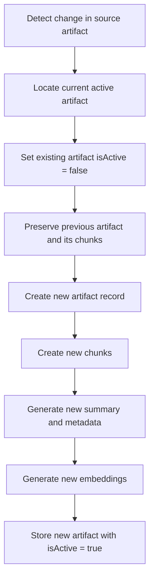

Previous versions therefore remain available in the database rather than being deleted.

This provides two benefits:

### Historical preservation

Older representations of an artifact and their chunks remain stored in the database.

### Current-information retrieval

RAG queries only consider active artifacts.

Conceptually:

```sql
WHERE isActive = TRUE
```

ensures that retrieval operates over the current version of the knowledge base while older versions remain available for provenance and historical tracking.

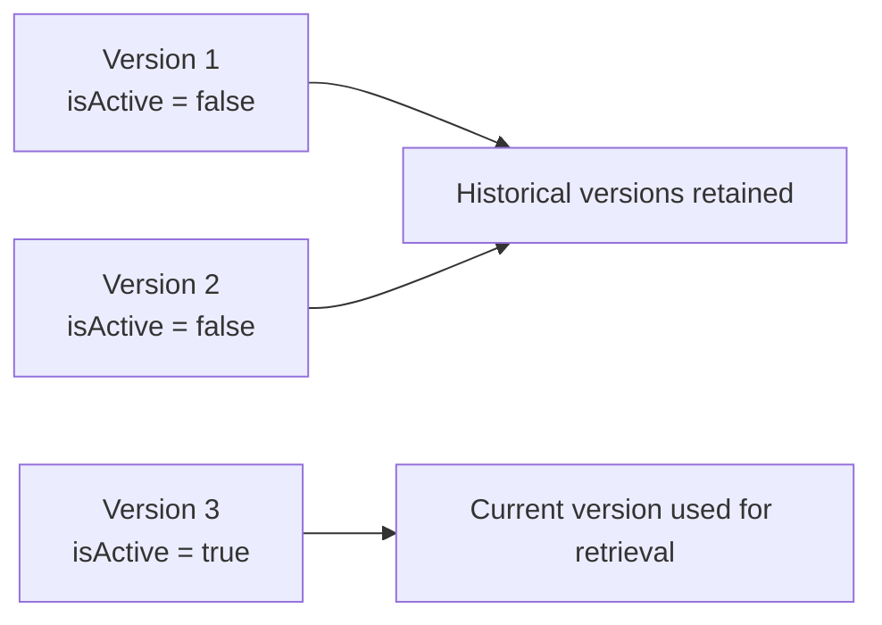

The automatic synchronization workflow that detects source changes and performs this lifecycle is not yet integrated into the current branch, but the database and retrieval design already support this mechanism.

---

## 14. RAG Pipeline

The current retrieval implementation is contained primarily in:

```text
backend/rag/RAG_Pipeline.ipynb
```

Two retrieval strategies are currently implemented:

1. Top-down retrieval
2. Bottom-up retrieval

They use the same database but begin retrieval at different levels of the artifact hierarchy.

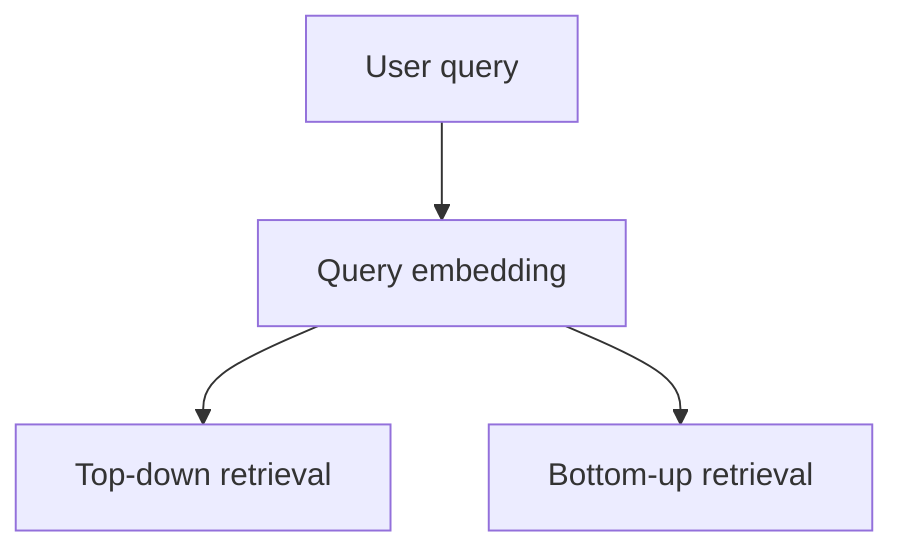

---

## 15. Top-Down RAG

Top-down retrieval follows an **artifact-first** strategy.

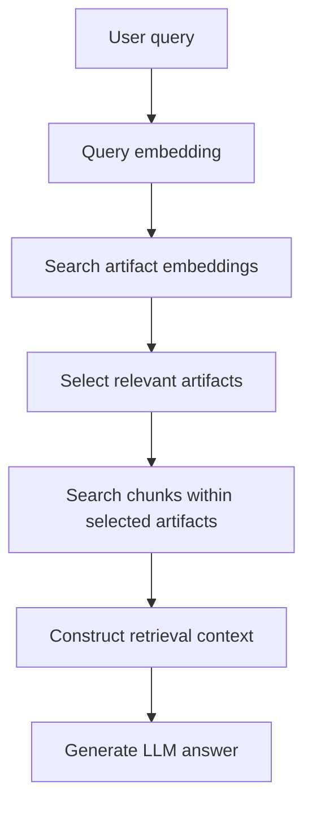

The first retrieval operation therefore identifies which complete resources are most relevant to the question.

Chunk retrieval is then restricted to those artifacts.

This strategy is useful when the question requires broader resource-level context or when identifying the appropriate document, repository, dataset, or publication is an important part of retrieval.

The current implementation also includes query-scope classification to help determine how aggressively candidate artifacts should be pruned.

Current scope categories include:

- `focused`
- `synthesis`
- `exploratory`

This classification influences artifact selection within the Top-down pipeline.

It should not be confused with the future Hybrid router described below.

Example retrieval outputs are stored in:

```text
backend/rag/rag_results_topdown.json
```

---

## 16. Bottom-Up RAG

Bottom-up retrieval follows an **evidence-first** strategy.

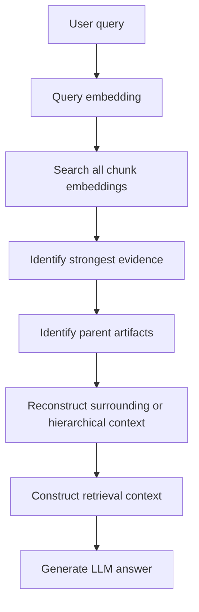

Unlike Top-down retrieval, Bottom-up retrieval does not require an artifact to rank highly before one of its chunks can be discovered.

This is useful for specific factual, procedural, or evidence-oriented questions where the strongest matching evidence may be contained in a relatively small part of an artifact.

After the initial global chunk retrieval, the pipeline reconstructs additional context using the relationship between chunks and their parent artifacts.

The reconstruction process can vary according to source structure. Depending on the source, this may include:

- neighboring chunks;
- parent chunks;
- document hierarchy;
- file continuity;
- artifact metadata and summary information.

Example retrieval outputs are stored in:

```text
backend/rag/rag_results_bottomup.json
```

---

## 17. Top-Down vs. Bottom-Up

The two strategies represent different retrieval assumptions.

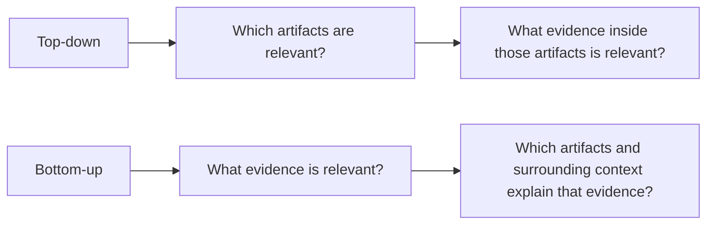

Neither strategy is expected to dominate for every type of question.

This motivates the Hybrid strategy currently planned.

---

## 18. Planned Hybrid RAG Strategy

The next retrieval component is a **query-adaptive Hybrid RAG pipeline**.

The Hybrid pipeline will classify the information need and determine which retrieval path is most appropriate.

Broad or artifact-oriented questions may favor Top-down retrieval.

Specific factual or evidence-seeking questions may favor Bottom-up retrieval.

Mixed, ambiguous, or compound questions may invoke both retrieval strategies.

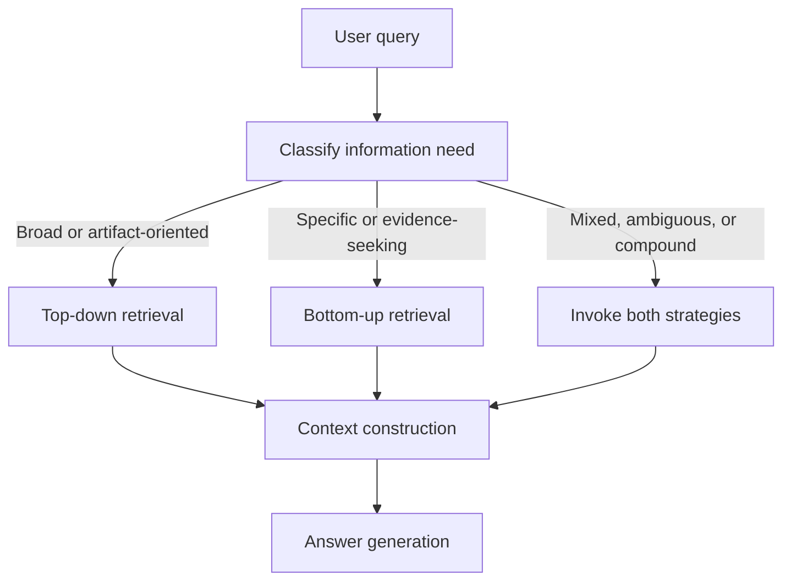

The current design objective is therefore:

> classify the information need first, then select the retrieval behavior rather than applying the same retrieval strategy to every query.

The exact routing logic and combination mechanism are still under development.

---

## 19. Current Development Status

### Implemented

- Common artifact–chunk data model
- PostgreSQL database structure
- CIROH Hub ingestion
- JavaScript-page to MDX handling for CIROH Hub
- GitHub repository ingestion
- HydroShare dataset ingestion
- Scientific publication ingestion
- Artifact JSON generation
- Chunk JSON generation
- Artifact summaries
- Source-specific metadata handling
- Artifact embeddings
- Chunk embeddings
- Top-down RAG
- Bottom-up RAG
- Initial results for both retrieval strategies
- `isActive` support in retrieval

### In Progress / Planned

- Hybrid query-adaptive retrieval
- Systematic routing between Top-down and Bottom-up
- Combined retrieval for mixed or ambiguous queries
- Automatic artifact synchronization
- Conversion of notebook logic into production-oriented modules/scripts
- Backend API
- Frontend integration
- End-to-end deployment workflow

---

## 20. Intended End-to-End Architecture

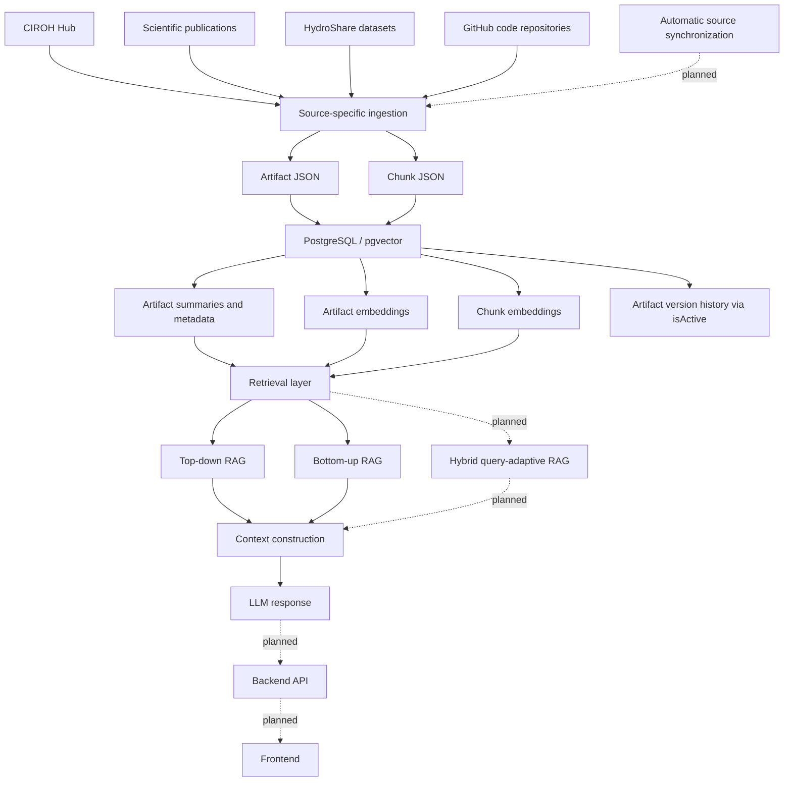

---

## 21. Development Note

The current repository should be considered an active development version of the CIROH AI Bot v2 backend.

Several components are currently implemented in notebooks to support rapid development, inspection, and testing. As the architecture stabilizes, the reusable functionality can be moved into scripts or modules and exposed through an API for integration with the frontend.
